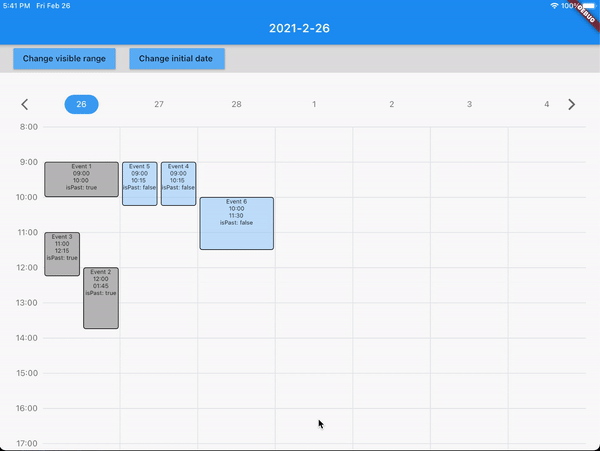

# simple_timetable

Simple timetable.

## Getting Started



##### Event model

```dart
class Event<T> {
  final String id;
  final DateTime start;
  final DateTime end;
  final DateTime date;
  final T payload;

  Event({
    @required this.id,
    @required this.start,
    @required this.end,
    @required this.date,
    this.payload,
  });
}
```

##### Usage

```dart
Widget build(BuildContext context) {
  return Scaffold(
    body: SimpleTimetable<TimeTableEvent>(
      onChange: (DateTime date, TimetableDirection dir) {
        print('On change date: $date');
        print('On change direction: $dir');
      },
      initialDate: DateTime.now(),
      dayStart: 8,
      dayEnd: 24,
      events: _events,
      buildCard: (Event event, bool isPast) {
        return GestureDetector(
          onTap: () {},
          child: Container(
            decoration: BoxDecoration(
              borderRadius: BorderRadius.circular(4),
              color: Colors.blue.withOpacity(0.3),
            ),
            child: Column(
              children: [
                Text(
                  '$isPast',
                  maxLines: 1,
                ),
              ],
            ),
          ),
        );
      },
    ),
  );
}
```
